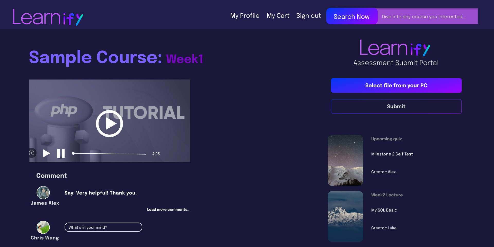
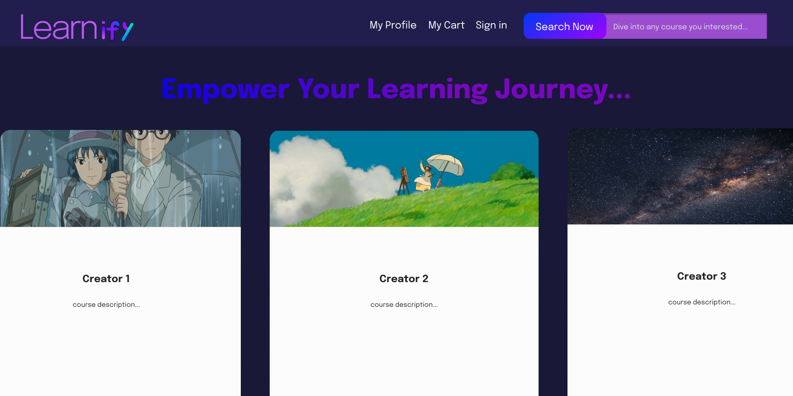

# Learnify Online Learning Platform (CodeIgniter 4)

This is a modular, MVC-based online learning platform called Learnify built with **PHP (CodeIgniter 4)**. The application includes a user authentication system, video management features, file uploads, profile handling, and third-party API integration. The backend leverages MongoDB for data persistence.

---

## Interface Preview

### Main Dashboard (Video Playback, User Feed)

<p align="center">
  
</p>

### Course Description Page

<p align="center">
  
</p>

---

## Features

- User authentication: registration, login, password reset, email verification
- Secure session and CSRF protection
- File upload and download system
- Video playback, like, comment, search, and course association
- Profile view and edit
- Notifications and third-party API integrations (e.g., weather, maps)
- MongoDB integration (requires `ext-mongodb`)

---

## Technologies Used

- PHP 8.2+
- CodeIgniter 4.3.2
- Composer for dependency management
- MongoDB (via `mongodb/mongodb` PHP library and `ext-mongodb`)
- HTML, CSS, JavaScript

---

## Requirements

- macOS or Linux
- PHP 8.2
- Composer (https://getcomposer.org/)
- MongoDB server
- PHP MongoDB extension (install via `pecl install mongodb`)
- A valid hostname or domain accessible from the browser

---

## Setup Instructions

### 1. Clone the Repository

```bash
git clone https://github.com/yourusername/your-repo.git
cd your-repo
```

### 2. Install Dependencies

```bash
composer install
```

### 3. Configure the Application

Copy the example environment file:

```bash
cp env .env
```

Set the base URL to match your deployment domain in `app/Config/App.php`:

```php
public string $baseURL = 'https://your-domain.com/';
```

Note: Do not set this to `localhost`, as some app logic and redirection depend on a full domain structure.

Ensure MongoDB extension is installed:

```bash
php -m | grep mongodb
# should return: mongodb
```

### 4. Start the Development Server

```bash
php spark serve
```

Access the application at your specified domain or `http://localhost:8080` if you're testing.

---

## Project Structure Overview

```
├── app/
│   ├── Controllers/         # Core controllers (Login, Video, Upload, Profile)
│   ├── Models/              # MongoDB-based data models
│   ├── Views/               # HTML templates
│   ├── Config/              # App config and routing
├── public/                  # Web root (index.php)
├── composer.json            # Project dependencies
```

---

## Common Routes

| Path | Controller::method | Description |
|------|---------------------|-------------|
| `/login` | `Login::index()` | User login page |
| `/login/register` | `Login::register()` | Registration form |
| `/upload` | `Upload::index()` | Upload page |
| `/video` | `Video::index()` | Video dashboard |
| `/profile` | `Profile::index()` | User profile |

---

## MongoDB Configuration

Make sure a local or remote MongoDB instance is running and accessible. Modify your MongoDB connection logic in `Models/` accordingly, typically using:

```php
$client = new MongoDB\Client("mongodb://localhost:27017");
```

---

## API Key Configuration

This project integrates with third-party APIs such as **Sendinblue** and **Google Maps**. You must manually configure your own API keys before deploying or running the app.

### 1. Google Maps API Key

Replace the placeholder `YOUR_GOOGLE_API_KEY` in the following line (typically located in `app/Views/video.php`):

```html
<script src="https://maps.googleapis.com/maps/api/js?key=YOUR_GOOGLE_API_KEY"></script>
```

with your actual Google Maps API key.

To obtain one, visit: https://console.cloud.google.com/apis/credentials

---

### 2. Sendinblue API Key

To enable email verification and password reset via Sendinblue SMTP, you’ll need to set your API key in a `.env` file like so:

```ini
SENDINBLUE_API_KEY=your_actual_api_key
```

Then, update all occurrences of:

```php
"api-key: your_api_key_here"
```

with:

```php
"api-key: " . getenv('SENDINBLUE_API_KEY')
```

Used in:
- `app/Controllers/Login.php`
- `app/Controllers/Upload.php`
- `app/Controllers/Video.php`

---

## Notes

- If your base URL is misconfigured, redirects and asset loading may fail.
- MongoDB extension compatibility: use `ext-mongodb` v1.21.x with `mongodb/mongodb` v1.15–1.21.

---

## License

This project is open-sourced under the MIT license.
